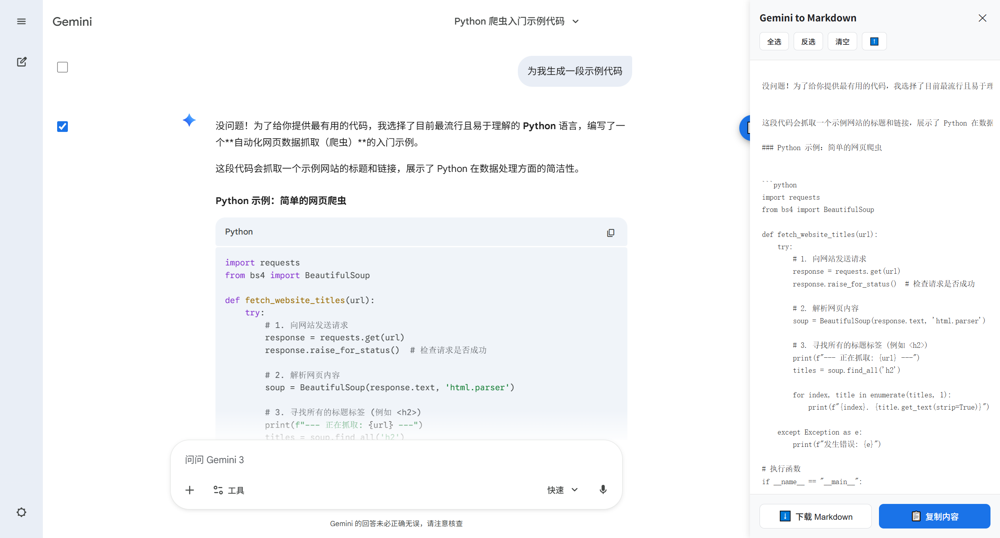
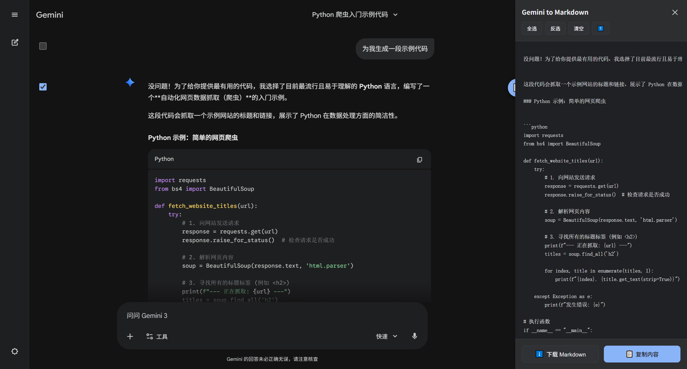
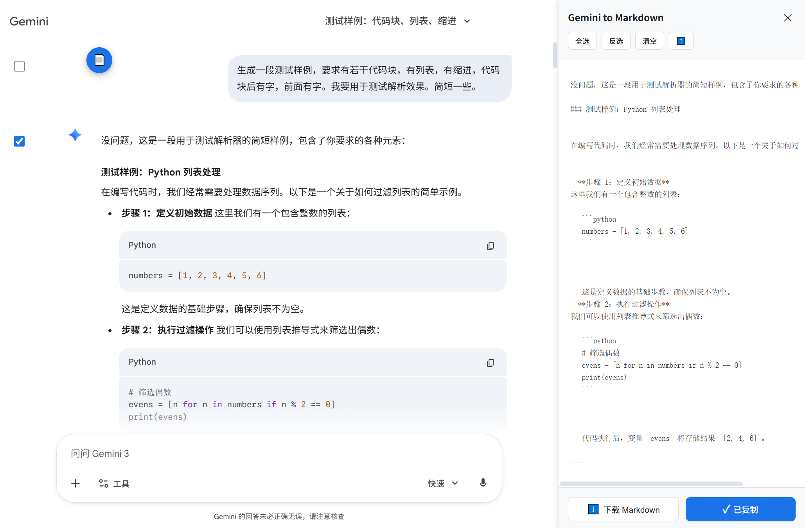
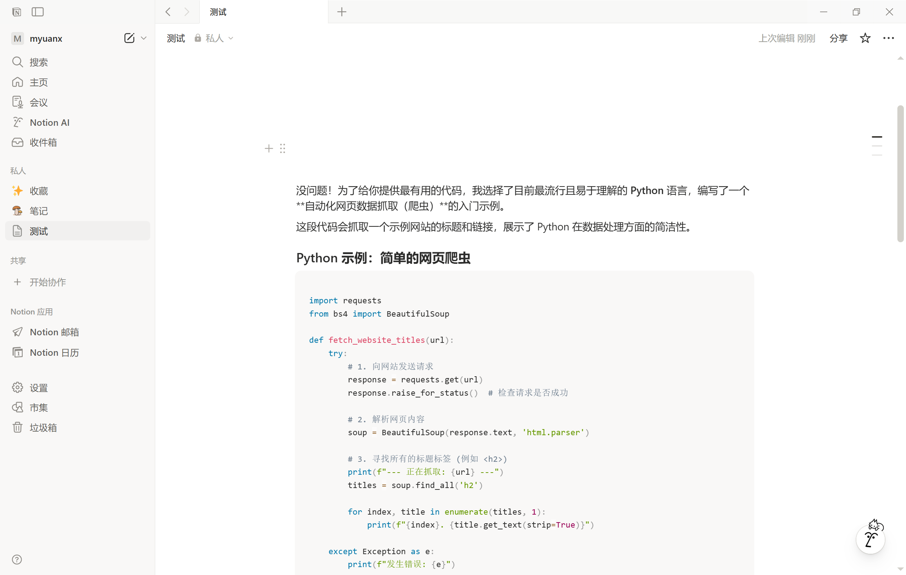

# Gemini to Markdown

<div align="center">

一个用于导出 Google Gemini 对话为 Markdown 格式的浏览器插件

[](https://opensource.org/licenses/MIT)
[](https://chrome.google.com/webstore)
[](https://github.com/myuan19/gemini-export-extension)
[](https://github.com/myuan19/gemini-export-extension)

[English](./README_EN.md) | 简体中文

</div>

---

## ✨ 功能特性

由于原生的哈基米复制功能不是太好用，每次插入notion都要手动调整代码块，于是有了此项目。

目前转换markdown的功能对于较为复杂的HTML格式仍可能有些小毛病，但绝大多数的情况下导出的md插入notion和typora都能正常解析。

- ✅ **批量选中对话导出** - 支持 Markdown 格式，复制和导出文件
- ✅ **批量操作** - 全选、反选、清空，快速管理消息选择
- ✅ **实时预览** - 右侧侧边栏实时显示 Markdown 格式预览
- ✅ **良好markdown支持** - 深度解析 DOM，导出的markdown兼容效果好
- ✅ **快捷键支持** - 点击预览区域后按 Ctrl+A（Mac: Cmd+A）快速全选文本
- ✅ **可拖动悬浮球** - 触发按钮可拖动到屏幕任意位置，支持边缘吸附和位置记忆
- ✅ **自动主题适配** - 支持两种主题（深/浅），自动切换


## 📸 截图展示

### 浅色主题


### 深色主题


### 悬浮球拖拽


### Notion 导入效果


</div>

## 🚀 快速开始

### 📋 前置要求

- Chrome 浏览器（推荐最新版本）
- 访问 Google Gemini 的权限

### 安装方法

#### 方法一：从源码安装（推荐用于开发）

**1. 获取源码**

```bash
# 克隆仓库
git clone https://github.com/myuan19/gemini-export-extension.git
cd gemini-export-extension

# 或直接下载 ZIP 文件并解压
```

**2. 加载插件到 Chrome**

1. 打开 Chrome 浏览器
2. 在地址栏输入：`chrome://extensions/`
3. 开启右上角的 **"开发者模式"** 开关
4. 点击左上角的 **"加载已解压的扩展程序"** 按钮
5. 选择 `gemini-export-extension` 文件夹
6. 确认插件已出现在扩展列表中（没有红色错误提示）

✅ **安装完成！** 你应该能看到插件图标出现在 Chrome 工具栏中。

#### 方法二：从 Chrome Web Store 安装

（待发布）

### 使用方法

#### 基本使用

1. **访问 Gemini**
   - 打开 [Google Gemini](https://gemini.google.com)
   - 登录你的 Google 账号

2. **打开导出功能**
   - 页面右下角会出现一个蓝色的 **📄** 按钮
   - 点击按钮打开导出侧边栏

3. **选择消息**
   - 左侧每条消息前会出现复选框
   - 勾选要导出的消息
   - 或使用顶部工具栏：
     - **全选** - 选择所有消息
     - **反选** - 反转当前选择状态
     - **清空** - 清除所有选择
     - **⬆️** - 快速滚动到对话顶部

4. **导出内容**
   - 右侧会实时显示 Markdown 预览
   - 点击 **📋 复制内容** 复制到剪贴板
   - 或点击 **⬇️ 下载 Markdown** 下载文件
   - 💡 **快捷键**：点击预览区域后，按 **Ctrl+A**（Mac: **Cmd+A**）可快速全选文本

#### 高级功能

**拖动悬浮球**

- 可以拖动 **📄** 按钮到屏幕任意位置
- 靠近边缘时会自动吸附（左、右、上、下）
- 按钮位置会自动保存，下次打开时会自动恢复

**快捷键操作**

- 点击预览区域使其获得焦点
- 按 **Ctrl+A**（Mac: **Cmd+A**）全选预览文本，然后使用 **Ctrl+C**（Mac: **Cmd+C**）复制

**主题适配**

- 插件会自动检测 Gemini 的主题（深色/浅色）
- 界面会自动适配，完美融入 Gemini 界面

> 💡 **提示**：悬浮球可以拖动到屏幕任意位置，靠近边缘时会自动吸附，位置会自动保存。

## 思维导图


## 📄 许可证

本项目采用 [MIT 许可证](./LICENSE) 开源。
